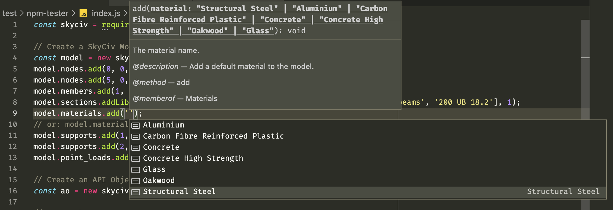

# The SkyCiv NPM Package

This package provides helpful tools to create objects and interact with the SkyCiv API. These components can be used to quickly construct models by providing code completion, parameter information and examples.

<div style="text-align: center;">
    
</div>

The SkyCiv API documentation can be found here: https://skyciv.com/api/v3/

The SkyCiv NPM package documentation can be found here: https://skyciv.com/api/v3/npm-package-docs/1.2.0

## Install

`npm i skyciv`

## Example

```js
const skyciv = require('skyciv');

// Create a SkyCiv Model object
const model = new skyciv.Model('metric');
model.nodes.add(0, 0, 0);
model.nodes.add(5, 0, 0);
model.members.add(1, 2, 1);
model.sections.addLibrarySection(['Australian', 'Steel (300 Grade)', 'Universal beams', '200 UB 18.2'], 1);
model.materials.add('Structural Steel');
// or: model.materials.addCustom('Custom Steel', 7850, 210000, 0.29, 300, 440, 'steel');
model.supports.add(1, 'FFFFFR');
model.supports.add(2, 'FFFFFR');
model.point_loads.add('m', null, 1, 30, 0, -5);

// Create an API Object
const ao = new skyciv.ApiObject();

// Set auth
ao.auth.username = 'YOUR_SKYCIV_USERNAME';
ao.auth.key = 'YOUR_SKYCIV_API_KEY';

// Set functions
ao.functions.add('S3D.session.start', { keep_open: true });
ao.functions.add('S3D.model.set', { s3d_model: model });
ao.functions.add('S3D.model.solve', { analysis_type: 'linear' });
ao.functions.add('S3D.file.save', { name: 'package-demo', path: 'api/NPM/' });

// Your function to handle the response
const callback = (res) => {
	console.log(res);
};

// Send the object to the API
ao.request(callback);
```

---

## Global Methods

### `skyciv.request(apiObject, callback?, options?)`
> **Note: We recommend using the `.request` method of the ApiObject class rather than this function as seen in the above sample.**

Make a request to the SkyCiv API. The callback function receives the parsed response.

```js
const skyciv = require('skyciv');

const apiObject = {...}; // A custom built object
// or
const apiObject = new skyciv.ApiObject();

skyciv.request(apiObject, function(res) {
    // Do something with results object "res"
}, options);
```

### `skyciv.requestPromise(apiObject, options?)`
Make a request to the SkyCiv API and receive a pending promise.

```js
const skyciv = require('skyciv');
async function main() {
    
    const apiObject = {...}; // A custom built object
    // or
    const apiObject = new skyciv.ApiObject();

    // then
    const skycivResponse = await skyciv.requestPromise(apiObject);
    // Do something with the response
}

main();
```


## Manually building the API Object
Visit the [API docs](https://skyciv.com/api/v3/docs/getting-started) for instructions on how to create an instance of the SkyCiv API object.

## Changelog

| Version  | Breaking          | Description     |
| :---     | :---              | :---            |
| 1.2.0    | false             | • Added 37 new classes including the ApiObject() and Model() classes.   |
| 1.1.1    | false             | • README.md patch   |
| 1.1.0    | true (for nodejs) | • `skyciv.request()` now returns parsed JSON for node.js<br/>• Added `skyciv.requestPromise()`   |
| 1.0.1    | true              | • Changed `skyciv.skyciv.request()` to `skyciv.request()` |
| 1.0.0    | -                 | Initial release |